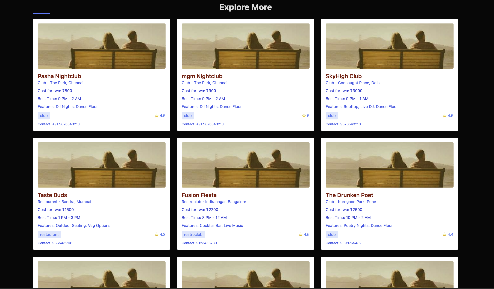

                                    STAYZO APP: Explore more with less money

Stayzo is a modern and efficient explore with less budget and built with React.js on the frontend and backend build with use of node.js and express.js and for database uses mongodb.and deployed on an AWS EC2 instance. It provides a seamless experience for users to book accommodations effortlessly.In this web application you can explore food, stay and good place to visit and you can book your accommandation and order food and pay ammount in dollar with the card payment only. Basically it web Application where you can explore more and more place with your limited budget. And your password will secure and hashing type and if you order food then tracking is also avalibale and if your order will not deliver on time then refund is also there and your food will be free of cost and All is done with good UI/UX ..!!

how my stayzo app is looks like..!!!

Features

User-friendly interface for easy navigation.

Secure authentication for users and administrators.

Real-time availability checking and booking.

Payment gateway integration for secure transactions.

Admin dashboard for managing bookings and users.

Optimized for speed and scalability.

Technologies Used

Frontend: React.js

Backend: Node.js (Express)

Database: MongoDB

Deployment: AWS EC2

Installation

Clone the repository:

git clone https://github.com/shubhamiit9162/stayzo_app.git

Set your Environment with .env file :
PORT
MONGO_URI
JWT_SECRET

cd stayzo

Install dependencies:

npm install

Start the development server:

npm start

Access the application at http://localhost:3000

Deployment

Deployed on AWS EC2.

Ensure that the EC2 instance has the necessary security configurations and environment variables set up.

Contributing

Feel free to submit pull requests or report issues to improve the project.
